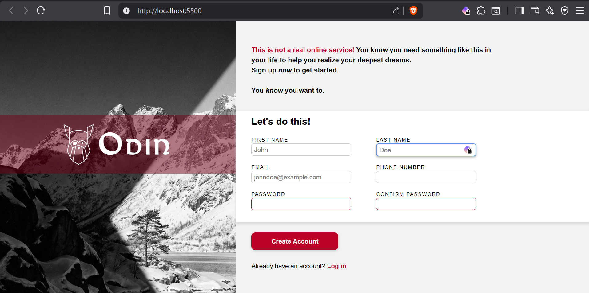

# Form Project

This is a project from Odin Project Full Stack JavaScript curriculum, the goal is to reproduce the styling and as well as some light requirements for a form page.

| Original Request                   | My Version                  |
| ---------------------------------- | --------------------------- |
|  |  |

Resources used:

- **Font**: Balgruf, made by Paul J. Miller, available at [this link](https://www.fontsquirrel.com/fonts/balgruf).
- **Background image**: Made by Gemini AI.
- **Logo**: Provided by the exercise creators, available at [this link](https://www.theodinproject.com/lessons/node-path-intermediate-html-and-css-sign-up-form).
- **Mockup image**: Provided by the exercise creators, available at [this link](https://www.theodinproject.com/lessons/node-path-intermediate-html-and-css-sign-up-form).